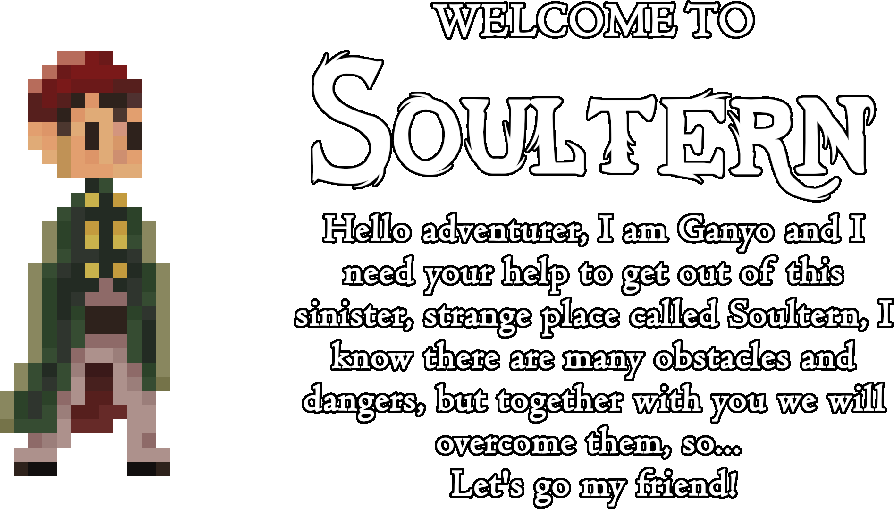

  
  

  
  
  
  

  

<h1>📖 About</h1>
<h3> <big>  It's been a tough night in one of your friends's house. On the way home, a tree branch falls and hits you. You faint and fall.  Later, waking up, you realise, you're somewhere you've never been before. Meet new friends, defeat vicious enemies, explore uncharted lands. Your objective is simple: Find the way home. </h3>
<h1>🏆 The Team</h1>
<h3><big><a href="https://github.com/SSUzunov19">Stas Uzunov</a>  - Scrum Trainer</big></h3>
<h3><big><a href="https://github.com/DZGeorgiev19">Daniel Georgiev</a>  - Scrum Trainer</big></h3>
<h3><big><a href="https://github.com/TNKompanska19">Teodora Kompanska</a>  - Scrum Trainer</big></h3>
<h3><big><a href="https://github.com/YSStoyanov20">Yordan Stoyanov</a> - Front-end Developer</big></h3>
<h3><big><a href="https://github.com/PDMatsaliev20">Petar Matsaliev</a> - Front-end Developer</big></h3>
<h3><big><a href="https://github.com/GGGeorgiev20">Galin Georgiev</a> - Back-end Developer</big></h3>
<h3><big><a href="https://github.com/NTIvanova21">Nadezhda Ivanova</a> - Web Developer</big></h3>
<h3><big><a href="https://github.com/DKGeorgiev21">Dimitar Georgiev</a> - Web Developer</big></h3>

<h1>📄 Documentation</h1>
<h3> ➤ <a href="https://github.com/codingburgas/Control-Break/blob/main/Documentation/Documentation.docx">Documentation</a> </h3>
<h3> ➤ <a href="https://github.com/codingburgas/Control-Break/blob/main/Documentation/Presentation.pptx">Presentation </a> </h3>
 
<h1>📥 Download</h1>
  <h3><a href="https://1drv.ms/u/s!Asm7loXlxLz7awJdC0Bm97ftQFM?e=D1w20q">Download Soultern</a></h3>

<h1>💻 Used Technologies</h1>
  <h3><big> C# - Main Language</big></h3>
  <h3><big>  Unity - Game Engine</big></h3>
  <h3><big>  VS Code - Text Editor</big></h3>
  <h3><big>  Git - Source Control</big></h3>
  <h3> Bootstrap - Framework</h3>
  <h3> HTML - Webpage</a>
  <h3> CSS - Web styling</a>
  <h3><big>  MS Word - Documentation</big></h3>
  <h3><big>  MS PowerPoint - Presentation</big></h3>